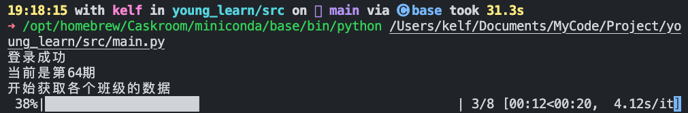
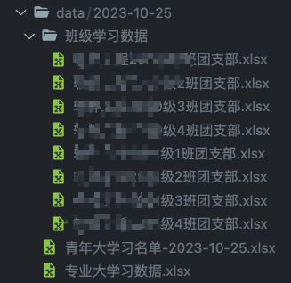

# 关于本项目

项目用于一键拉取青年大学习后台数据，方便大家进行数据分析。

运行过程：

运行完成后生成文件：

生成统计图

项目文档 https://www.yuque.com/kelf/kv37w9?# 《青年大学习数据拉取项目》

# 使用

请查看语雀文档：

https://www.yuque.com/kelf/kv37w9/xiq9t9stev517273?singleDoc# 《使用》

# 更新日志

https://www.yuque.com/kelf/kv37w9/lvq6wnwmrcstsh3x?singleDoc# 《更新日志》